From our previous adventures in math and physics, we have some basic knowledge of trigonometric functions---sine, cosine, tangent, and the like. In those classes, in the past, we've defined trig functions in terms of a right triangle, like so:

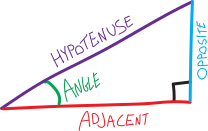{width=50%}
{width=50%}
{width=50%}
{width=50%}

These definitions are awesome, because they are the Rosetta Stone that allow us to go from talking about *angles* to talking about *distances*. (In physics: from *circular rotation* to *linear motion*). Using trig functions and their inverses, we can go back and forth between angles in a triangle and side lengths:

{width=50%}
{width=50%}
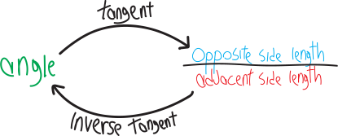{width=50%}

You might have seen this old XKCD^[https://xkcd.com/809/], making fun of the “soh cah toa” mnemonic that people use to memorize which functions correspond with which sides:

In math and physics, you've probably used calculators to find sines and cosines most of the time. But you've probably also seen that there are some special angles, like $\pi/6 = 30\degree$, of which we can find the sine/cosine/tangent *exactly*, and not as a crude and ugly decimal approximation. We can do this using these two special right triangles:
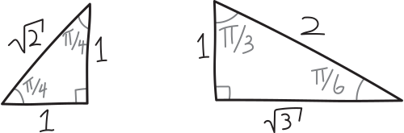{width=75%}

For example, we can exactly evaluate $\sin(\pi/3)$ by looking at the special right triangle with a $\pi/3$ angle, seeing that the side opposite to $\pi/3$ has length $\sqrt{3}$, and seeing that the hypotenuse of that triangle has length $2$. So then:
\begin{align*}
\sin\left(\frac{\pi}{3}\right) &= \frac{\quad \text{length of the side opposite }\pi/3 \quad}{\text{length of the hypotenuse} } \\ \\
&= \frac{\sqrt{3}}{2}
\end{align*}
If you plug this into your calculator, you get $0.866025404$ish, which is ugly and gross. $\frac{\sqrt3}{2}$ is much nicer! $\frac{\sqrt{3}}{2}$ is a beautiful, tractable, irrational number. That other thing is just a lousy, low-resolution, dastardly decimal approximation. We certainly don't want to think in terms of decimals! But this begets two problems:
<ul>
<li>  First, using this method, we still might not be able to calculate every trig function nicely. For example, what's $\sin(7\pi/34)$? We don't know, because we don't know any special right triangles with a $7\pi/34$ angle in them. Like with division and logarithms, we are restricted to evaluating *only some* trig functions exactly and beautifully. The others we need to use a calculator for. (Your calculator uses formulas that fill in the gaps to estimate trig functions as decimal approximations, like it does with logs... just like we have "long division," there's some sort of “long trigonometry” to compute these things exactly!)
<li> Second, our definition of these trig functions is based on triangles. Specifically, on the angles in, and the ratio of the sides of, right triangles. But the angles in a right triangle have to be between $0$ and $90\degree$. What if we want to find the sine of some angle greater than $90\degree$? We can't make a right triangle that has an angle greater than $90\degree$, so we can't find the sine/cosine/tangent of any angle greater than $90\degree$. What if we want to find the sine/cosine/tangent of a negative angle? We certainly can't make a right triangle with a negative angle. (Do negative angles even exist? Is it even reasonable to talk about such things? Isn't that like having a negative distance?) This is the downside to our current definition of trig functions. It restricts us to only finding trig functions of angles between $0$ and $90$ degrees.

In other words, if we were to draw graphs of our trig functions, they'd look all sad and lonely and tiny like this:
{width=75%}
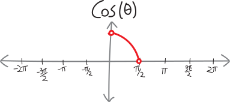{width=75%}
{width=75%}
All of that space on the real number line! Going infinitely far to the left and to the right! And yet our trig functions take up such a tiny percentage of it.
</ul>
We can't do a lot about the first problem. The fact that there are some angles that we can't easily and cleanly compute the sine/cosine/tangent of is something we're going to have to figure out how to live with. 

But the second problem is something we can fix! What if we wanted our trig functions to be less sad and lonely? What if we want them to go way further to the left and to the right? What if we want to find the sine/cosine/tangent of angles less than $0\degree$, and greater than $90\degree$? What if we want to find the sine/cosine/tangent of *any* number? Can we somehow extend our definition so that we can do that??

Here's my idea: let's use the **coordinate plane**. There are two very different approaches to geometry: we can either think of geometry as being made of abstract shapes floating out in the ether, moving around without any fixed reference points. That's how the ancient Greeks thought of geometry. Or---following the lead of Renaissance mathematicians---we can mash up geometry and algebra, and do geometry *on a coordinate plane*, in which all of our shapes and lines and points have specific addresses. So let's put our special right triangles on a coordinate plane!!!

But, actually, let's make one tiny tweak first. Let's scale them all down so that they have a hypotenuse of $1$. (We'll see why in a second.) So if we divide all the side lengths by the length of the hypotenuse, we've got the same triangles (same angles, lengths in the same proportion), or rather, I guess we've got *similar* triangles:

{width=75%}
So let's see what happens if we put a $\frac{\pi}{6}-\frac{\pi}{3}-\frac{\pi}{2}$ triangle on the coordinate plane, with the $\pi/6$ angle on the origin:
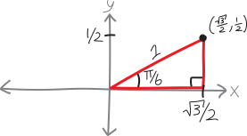{width=75%}
What's the sine of $\pi/6$? It's $1/2$... but that's also the $y$-coordinate of the tip of the triangle! What's the cosine of $\pi/6$ ? It's $\sqrt{3}/2$---but that's also the $x$-coordinate of the tip of the triangle! Huh.

The same thing happens if we put our $\frac{\pi}{4}-\frac{\pi}{4}-\frac{\pi}{2}$ triangle on a coordinate plane:
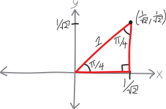{width=75%}
The sine of $\frac{\pi}{4}$ is $\frac{1}{\sqrt{2}}$---and that's also the $y$-coordinate of the tip of the triangle! The cosine of $\frac{\pi}{4}$ is $\frac{1}{\sqrt{2}}$---and that's also the $x$-coordinate of the tip of the triangle!

So what if we redefine our trig functions so that the sine is just the $y$-coordinate of the tip of a triangle made in this way, and so that the cosine of some angle is just the $x$-coordinate of the tip of a triangle made this way??? In other words, what if we redefine $\sin\theta$ and $\cos\theta$ in this way:

 $\sin\theta =$ the $y$-coordinate of the tip of a triangle made in this way  
 $\cos\theta =$ the $x$-coordinate of the tip of a triangle made in this way

This would let us take the sine and cosine of *negative* angles, because we could make a “negative” angle just by going on the opposite direction. So, for example, if we wanted to find the sine or cosine of $\pi/3$, we could go $\pi/3$ in the clockwise direction, and have something like this:
{width=75%}
So then the sine of $\pi/3$, if it's the $y$-coordinate of this triangle, would be $-\sqrt{3}/2$. The cosine, if it's the $x$-coordinate, is still $+1/2$. And tangent, if we want to know that, too, is still just sine divided by cosine, or $\frac{-\sqrt{3}/2}{+1/2} = -\sqrt{3}$. 

What if we want to find the sine/cosine of an angle that's bigger than $90^\circ$? I guess we could draw an angle in the same way, starting at the origin and rotating counterclockwise. Let's do that with $5\pi/6$:
{width=75%}
Of course, we can't make a right triangle that has an angle of $5\pi/6$. But---analogous to what we just did---we can draw a line one unit out from the origin (just like the hypotenuse), and say that wherever that line ends---wherever it's $1$ away from the origin, at an angle of $5\pi/6$---the $x$ and $y$-coordinates will be the cosine and sine of $5\pi/6$, respectively:
{width=75%}
Of course, we don't actually know what those points are:
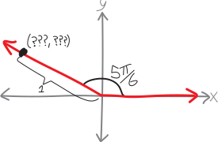{width=75%}
But we can find them! We can squeeze our $\frac{\pi}{6}-\frac{\pi}{3}-\frac{\pi}{2}$ special right triangle in there to figure out the $x$ and $y$-coordinates. We know that we can fit a $\pi/6$ angle into the space left over between $5\pi/6$ and the horizontal axis. We know the side lengths of that triangle, so then we can find the $x$ and $y$-coordinates of that point:
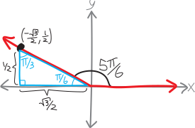{width=75%}
So then we can find the sine and cosine of $5\pi/6$! We have:
\begin{align*}
\sin\left(\frac{5\pi}{6}\right) &= \text{the } y\text{-coordinate of that point} = +\frac{1}{2} \\ \\
\cos\left(\frac{5\pi}{6}\right)  &= \text{the } x\text{-coordinate of that point} = -\frac{\sqrt{3}}{2}  \\ \\
\tan\left(\frac{5\pi}{6}\right) &= \text{still sine over cosine} = \frac{+1/2}{\quad-\sqrt{3}/2\quad} = -\frac{1}{\sqrt{3}}
\end{align*}
So that's going to be our motivating idea to extend the definition of trig functions. We're going to draw an angle on the coordinate plane---centered at the origin, considering counter-clockwise as the “positive” direction---and then we're going to draw a line extending out a distance of $1$. In other words, we're going to draw a line, and it'll intersect at some point with a circle of radius $1$:
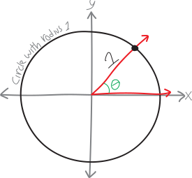{width=75%}
Wherever that line and the circle intersect, we'll define that to be sine and cosine! We'll define cosine as the $x$-coordinate of the intersection point, and sine as the $y$-coordinate:

**Trig functions, redefined in glory: **

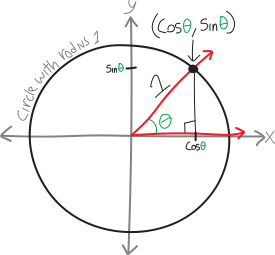

  \begin{align*}
\sin(\theta) &= \text{the }y\text{-coordinate on the unit circle, with angle }\theta \\
\cos(\theta) &= \text{the }x\text{-coordinate on the unit circle, with angle }\theta \\
\tan(\theta) &= \text{still just } \frac{\sin(\theta)}{\cos(\theta)}
\end{align*}

These are our new definitions of sine and cosine. So to calculate the sine/cosine/tangent of *any* angle (positive, negative, greater than $90^\circ$, whatever), we just have to draw the angle at the origin, and then draw a line of length $1$ out to the this circle of radius $1$ and see what the $x$ and $y$ coordinates are. The $x$-coordinate will be the cosine of that angle, and the $y$-coordinate will be the sine! (By the way, we'll call that circle of radius $1$ centered at the origin the **unit circle**, since that's the fancy name for it (the number $1$ being the **multiplicative unit**, i.e., the number that if we multiply it by any other number, we just get the number back).) Or, phrased more algorithmically, to calculate trig functions, we can:
<ul>
<li> Draw a pretty coordinate axis and draw the unit circle on it
<li> Draw the angle
<li> Then find the coordinates of where the angle intercepts the unit circle, either by
<ul>
<li> somehow squeezing in one of our special right triangles to figure out the length and width
<li> or maybe using some other geometric knowledge
</ul>
</ul>
I guess we can update our pretty visual definitions:

{width=50%}
{width=50%}
{width=50%}

Or, thinking of these as bidirectional functions with inverses:

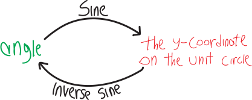{width=50%}
{width=50%}
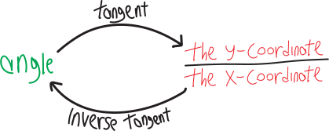{width=50%}

Note that this new definition of trig functions still gives us the same results as the old, right triangle definition, if $\theta$ is between $0$ and $90^\circ$. But it also gives us a way of calculating the sine and cosine of angles less than $0^\circ$, and greater than $90^\circ$! We've zoomed out. We've generalized. We can now take the sine/cosine/tangent of *any real number*:

{width=75%}

(Whither can we zoom out from here? What would it mean to take the sine/cosine/tangent of an *imaginary* number like $i$? Does that even make sense? Could we *make that* make sense???)

This new, more general definition of trig functions doesn't solve all our problems. We still can't calculate every single trig function as a decimal. We're limited, like before, to stuff we can easily calculate using a special right triangle (by fitting it somehow into that diagram). But that's okay! We've made progress.

{style='border:1px solid black; padding: 1em;'}

## Problems 

Using what you know about trigonometry, special right triangles, and the unit circle, evaluate the following trig functions without a calculator:

<ol class='problems'>
<li> $\sin(0)$
<li> $\cos(0)$
<li> $\tan(0)$
<li> $\sin(\pi)$
<li> $\cos(\pi)$
<li> $\tan(\pi)$
<li> $\sin(2\pi)$
<li> $\cos(2\pi)$
<li> $\tan(2\pi)$
<li> $\sin(3\pi)$
<li> $\cos(3\pi)$
<li> $\tan(3\pi)$
<li> $\sin(4\pi)$
<li> $\cos(4\pi)$
<li> $\tan(4\pi)$
<li> $\sin(-\pi)$
<li> $\cos(-\pi)$
<li> $\tan(-\pi)$
<li> $\sin(-2\pi)$
<li> $\cos(-2\pi)$
<li> $\tan(-2\pi)$
<li> $\sin(-3\pi)$
<li> $\cos(-3\pi)$
<li> $\tan(-3\pi)$
<li> $\sin(-4\pi)$
<li> $\cos(-4\pi)$
<li> $\tan(-4\pi)$
<li> $\sin(\pi/6)$
<li> $\cos(\pi/6)$
<li> $\tan(\pi/6)$
<li> $\sin(5\pi/6)$
<li> $\cos(5\pi/6)$
<li> $\tan(5\pi/6)$
<li> $\sin(7\pi/6)$
<li> $\cos(7\pi/6)$
<li> $\tan(7\pi/6)$
<li> $\sin(11\pi/6)$
<li> $\cos(11\pi/6)$
<li> $\tan(11\pi/6)$
<li> $\sin(13\pi/6)$
<li> $\cos(13\pi/6)$
<li> $\tan(13\pi/6)$
<li> $\sin(\pi/4)$
<li> $\cos(\pi/4)$
<li> $\tan(\pi/4)$
<li> $\sin(3\pi/4)$
<li> $\cos(3\pi/4)$
<li> $\tan(3\pi/4)$
<li> $\sin(7\pi/4)$
<li> $\sin(5\pi/4)$
<li> $\cos(5\pi/4)$
<li> $\tan(5\pi/4)$
<li> $\cos(7\pi/4)$
<li> $\tan(7\pi/4)$
<li> $\sin(9\pi/4)$
<li> $\cos(9\pi/4)$
<li> $\tan(9\pi/4)$
<li> $\sin(\pi/3)$
<li> $\cos(\pi/3)$
<li> $\tan(\pi/3)$
<li> $\sin(2\pi/3)$
<li> $\cos(2\pi/3)$
<li> $\tan(2\pi/3)$
<li> $\sin(4\pi/3)$
<li> $\cos(4\pi/3)$
<li> $\tan(4\pi/3)$
<li> $\sin(5\pi/3)$
<li> $\cos(5\pi/3)$
<li> $\tan(5\pi/3)$
<li> $\sin(7\pi/3)$
<li> $\cos(7\pi/3)$
<li> $\tan(7\pi/3)$
<li> $\sin(\pi/2)$
<li> $\cos(\pi/2)$
<li> $\tan(\pi/2)$
<li> $\sin(3\pi/2)$
<li> $\cos(3\pi/2)$
<li> $\tan(3\pi/2)$
<li> $\sin(5\pi/2)$
<li> $\cos(5\pi/2)$
<li> $\tan(5\pi/2)$
</ol>

